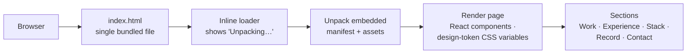

# Portfolio (2026)

**The 2026 personal portfolio of Nakul T, a B.Tech AI & Data Science student at KPR Institute of Engineering and Technology. It is shipped as a single self-contained HTML file.**

The whole site, including markup, styles, scripts and assets, is bundled into one `index.html` that unpacks itself in the browser. It needs no build step, server or external requests, so it can be hosted anywhere static files are served or simply opened locally.

---

## Sections

| Section | Content |
|---|---|
| Hero | Intro and headline |
| **Selected work** | Featured projects |
| **Experience** | Internships, roles and hackathons |
| **Stack** | Languages, frameworks and tools |
| **The record** | Achievements and stats |
| **Let's build** | Contact and links |

## Architecture



- **Self-contained bundle:** every asset is embedded in the HTML and unpacked at load time.
- **Design tokens:** colours, spacing and type scale are CSS custom properties (`--color-*`, `--space-*`), with an accent colour passed in as a prop.
- **Responsive:** fluid `clamp()` spacing and auto-fit grids.

## Running locally

```bash
git clone https://github.com/nakultt/portfolio-new.git
cd portfolio-new
python -m http.server 8000     # or just open index.html
```

JavaScript must be enabled, because the page renders client-side.

## Deploying

Upload `index.html` to any static host, such as GitHub Pages, Vercel, Netlify or Cloudflare Pages.
